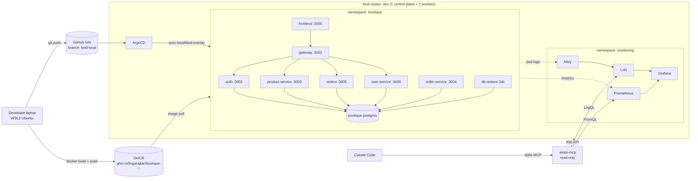

# DevOps + AIOps Playbook: Local Edition (kind, no AWS)

This fork runs the full [devops-ai-playbook](https://github.com/vishakhasadhwani/devops-ai-playbook) project on a **local kind cluster** instead of AWS EKS. Every AWS service is swapped for a local or free equivalent, so the lab costs **₹0** to run.

**What you get end to end:**

- A 7-service e-commerce app (React, Node.js, PostgreSQL) deployed with **GitOps (ArgoCD + Kustomize)**
- Images built locally and published to **GitHub Container Registry (GHCR)**
- **Metrics** (Prometheus + Grafana) and **logs** (Loki + Grafana Alloy)
- An **AIOps assistant**: a custom read-only **MCP server** (`aiops-mcp`) used by **Claude Code** to diagnose incidents from Kubernetes, Prometheus and Loki
- **Guardrails** that stop the AI from making changes without human approval

---

## Architecture



### AWS → local mapping

| Original (AWS) | This lab (local) |
|---|---|
| EKS + Terraform | kind cluster `dev` |
| ECR | GHCR (public packages) |
| EBS `gp2` StorageClass | kind `standard` (local-path) |
| Fluent Bit → CloudWatch Logs | Grafana Alloy → Loki |
| Prometheus + Grafana | kube-prometheus-stack (same) |
| ArgoCD | ArgoCD (Helm) |
| Bedrock Agent "Kira" + 3 Lambdas | `aiops-mcp` (Python MCP server) + Claude Code |

---

## Prerequisites

| Tool | Tested version | Notes |
|---|---|---|
| Windows + WSL2 (Ubuntu 22.04) | — | Give WSL **≥ 11 GB RAM** (see below) |
| Docker Desktop (WSL2 backend) | — | |
| kind | — | Cluster named `dev` |
| kubectl | v1.37 | |
| Helm | v3.22 | |
| Python | 3.10+ | For `aiops-mcp` |
| Claude Code | 2.1.x | Needs a Claude Pro/Max account |
| GitHub account | — | Fork + GHCR + classic PAT with `write:packages` |

### WSL memory

The full stack uses about 7–8 GB. The WSL default is half your Windows RAM, which is too tight on a 16 GB laptop. Set this in `C:\Users\<you>\.wslconfig`, then run `wsl --shutdown`:

```ini
[wsl2]
memory=11GB
processors=8
swap=6GB
```

---

## Repository layout (what this fork adds)

```
.
├── .claude/settings.json          # Claude Code guardrails for this repo
├── gitops/                        # ORIGINAL manifests (base) - left untouched
├── projects/boutique-microservices/
│   └── backend/services/product-service/src/routes/products.ts   # bug fixes (v2)
└── local/                         # everything specific to the local setup
    ├── README.md                  # this file
    ├── kps-values.yaml            # kube-prometheus-stack values
    ├── loki-values.yaml           # Loki (single binary, filesystem)
    ├── alloy-values.yaml          # Alloy log pipeline -> Loki
    ├── argocd-values.yaml         # ArgoCD (no dex/notifications, insecure UI)
    ├── argocd-app.yaml            # ArgoCD Application -> local/kind-overlay
    ├── kind-overlay/
    │   ├── kustomization.yaml     # GHCR images, local-path storage, restore Job
    │   └── db-restore-job.yaml    # creates + seeds the databases
    └── aiops-mcp/
        ├── server.py              # MCP server: fetch_health, fetch_logs, fetch_metrics
        └── requirements.txt
```

**Design rule:** the original `gitops/` folder is the **base** and is never edited. All local changes live in an **overlay** (`local/kind-overlay`). The overlay sits outside `gitops/` because Kustomize refuses an overlay nested inside its own base ("cycle detected").

---

## Setup

All commands run from the repo root (`~/devops-ai-playbook`) unless noted.

> **Slow network tip:** `helm install` from a repo URL can time out. Every chart below is downloaded first with `helm pull` (retry if needed), then installed from the local `.tgz`.

### Phase 1: Observability

```bash
helm repo add prometheus-community https://prometheus-community.github.io/helm-charts
helm repo add grafana https://grafana.github.io/helm-charts
helm repo update
kubectl create namespace monitoring
mkdir -p ~/charts

# Prometheus + Grafana (release name MUST be kube-prometheus-stack: the app's ServiceMonitor selects on it)
helm pull oci://ghcr.io/prometheus-community/charts/kube-prometheus-stack --destination ~/charts
helm upgrade --install kube-prometheus-stack ~/charts/kube-prometheus-stack-*.tgz \
  -n monitoring -f local/kps-values.yaml --wait --timeout 15m

# Loki (log store)
helm pull grafana/loki --destination ~/charts
helm upgrade --install loki ~/charts/loki-*.tgz \
  -n monitoring -f local/loki-values.yaml --wait --timeout 15m

# Alloy (log shipper: pods -> Loki)
helm pull grafana/alloy --destination ~/charts
helm upgrade --install alloy ~/charts/alloy-*.tgz \
  -n monitoring -f local/alloy-values.yaml --wait --timeout 10m
```

Key settings in `kps-values.yaml`:
- Alertmanager and kind's control-plane scrapes (etcd, scheduler, controller-manager, kube-proxy) are disabled. They bind to `127.0.0.1` on kind and always fail.
- `serviceMonitorSelectorNilUsesHelmValues: false` lets Prometheus pick up ServiceMonitors from any namespace.
- `grafana.sidecar.dashboards.searchNamespace: ALL` loads the app's dashboard ConfigMap from `boutique`.
- Loki is pre-wired as a Grafana data source.

**Verify:** in Grafana → Explore, run `up` (Prometheus) and `{namespace="monitoring"}` (Loki).

### Phase 2: Build and publish images to GHCR

Create a **classic** PAT with only `write:packages`. Fine-grained tokens can't push to GHCR from Docker and fail with `The token provided does not match expected scopes`.

```bash
export GH_USER=lingarajkar            # lowercase - GHCR rejects uppercase
export CR_PAT=<ghp_... token>
echo $CR_PAT | docker login ghcr.io -u $GH_USER --password-stdin

cd projects/boutique-microservices
for svc in gateway auth product-service order-service orders user-service; do
  docker build -t ghcr.io/$GH_USER/boutique-$svc:v1 backend/services/$svc \
    && docker push ghcr.io/$GH_USER/boutique-$svc:v1 || { echo "FAILED: $svc"; break; }
done
docker build -t ghcr.io/$GH_USER/boutique-frontend:v1 frontend \
  && docker push ghcr.io/$GH_USER/boutique-frontend:v1
cd -
```

Then make **each of the 7 packages public**: GitHub → Packages → package → Package settings → Change visibility. Check them:

```bash
# 200 = public, 401 = still private
for img in gateway auth product-service order-service orders user-service frontend; do
  echo "boutique-$img -> $(curl -s -o /dev/null -w '%{http_code}' \
    "https://ghcr.io/token?scope=repository:$GH_USER/boutique-$img:pull")"
done
```

> Use version tags (`v1`, `v2`), **never** `latest`. Kubernetes only pulls when the tag changes, and tags give you a clean rollback path.

### Phase 3: GitOps deploy with ArgoCD

```bash
# Preview what the overlay renders (no deploy)
kubectl kustomize local/kind-overlay | grep -E "image:|storageClassName|kind: Job"

# Install ArgoCD
helm repo add argo https://argoproj.github.io/argo-helm && helm repo update argo
helm pull argo/argo-cd --destination ~/charts
kubectl create namespace argocd
helm upgrade --install argocd ~/charts/argo-cd-*.tgz \
  -n argocd -f local/argocd-values.yaml --wait --timeout 15m

# Admin password (change it after first login, then delete this secret)
kubectl -n argocd get secret argocd-initial-admin-secret -o jsonpath="{.data.password}" | base64 -d; echo

# Register the app (points at the fork, branch kind-local, path local/kind-overlay)
kubectl apply -f local/argocd-app.yaml
```

Open the ArgoCD UI (see [Access](#access-port-forwards)) → **boutique** → **SYNC**. Sync is manual on purpose, so you see every change before it lands.

**Verify:**
```bash
kubectl get application boutique -n argocd     # Synced  Healthy
kubectl get pods -n boutique                   # 8 Running + db-restore Completed
```

### Phase 4: Use the app

Run both port-forwards. The React app runs in your browser and calls `http://localhost:3001/api`.

- Shop: http://localhost:3000
- API: http://localhost:3001/api/products, `/api/products/categories`, `/metrics`

`http://localhost:3001/` alone returns `{"error":"Service not found"}`. That's expected, because the gateway only routes `/api/*`.

### Phase 5: AIOps assistant (MCP + Claude Code)

```bash
cd local/aiops-mcp
python3 -m venv .venv
.venv/bin/pip install -r requirements.txt
cd -

# Prometheus + Loki port-forwards must be running (see Access)
claude mcp add --env PROM_URL=http://localhost:9090 --env LOKI_URL=http://localhost:3100 \
  --env ALLOWED_NAMESPACES=boutique --transport stdio aiops \
  -- ~/devops-ai-playbook/local/aiops-mcp/.venv/bin/python ~/devops-ai-playbook/local/aiops-mcp/server.py

claude mcp list     # aiops: ... ✔ Connected
claude
```

**Tools exposed by `aiops-mcp`** (all read-only, limited to `ALLOWED_NAMESPACES`):

| Tool | Source | Returns |
|---|---|---|
| `fetch_health` | Kubernetes API | Pods (phase, ready, restarts, last crash reason), deployments, Warning events, **service-wiring check** (Service `targetPort` vs pod `containerPort`) |
| `fetch_logs` | Loki | Recent lines by `app` label + regex filter, **including logs from crashed pods** |
| `fetch_metrics` | Prometheus | Any PromQL, instant or range (summarised: first/last/min/max) |

Built on the **MCP Python SDK v2** (`from mcp.server.mcpserver import MCPServer`). Most online tutorials still show the v1 `FastMCP` import, which no longer exists in v2.

**Example prompts:**
```
Use the aiops tools to give me a health report for the boutique namespace.
Does every Service in boutique route to a port its pods actually listen on?
Is Prometheus scraping metrics from every boutique service? Compare what's scraped with what's running.
Earlier today the auth service was crash-looping. Using logs from the last 6 hours, what was the root cause?
```

---

## Guardrails (`.claude/settings.json`)

```json
{
  "disableClaudeAiConnectors": true,
  "permissions": {
    "allow": ["mcp__aiops__*"],
    "ask":   ["Bash(kubectl *)", "Bash(helm *)", "Bash(docker push *)", "Bash(git push *)"],
    "deny":  ["Bash(kubectl delete *)"]
  }
}
```

- **`disableClaudeAiConnectors`**: claude.ai connectors (Gmail, Drive, Uber, …) are not loaded in this repo. An infra assistant gets infra tools only.
- **allow**: the read-only `aiops` tools run without prompts.
- **ask**: any cluster or registry change needs a human "yes", even in auto mode.
- **deny**: `kubectl delete` is blocked outright (tested: Claude stops and does not try to work around it).

Rules are evaluated **deny → ask → allow**, and each part of a compound command is checked separately.

> ⚠️ These rules match the command text, so they are a **guardrail, not a security boundary**. The real boundary is credentials: run `aiops-mcp` with a **read-only ServiceAccount** (see Roadmap).

---

## Access (port-forwards)

| What | Command | URL |
|---|---|---|
| Grafana | `kubectl port-forward -n monitoring svc/kube-prometheus-stack-grafana 3007:80` | http://localhost:3007 (admin / admin) |
| Prometheus | `kubectl port-forward -n monitoring svc/kube-prometheus-stack-prometheus 9090:9090` | http://localhost:9090 |
| Loki | `kubectl port-forward -n monitoring svc/loki-gateway 3100:80` | http://localhost:3100 |
| ArgoCD | `kubectl port-forward -n argocd svc/argocd-server 8080:80` | http://localhost:8080 |
| Gateway (API) | `kubectl port-forward -n boutique svc/gateway 3001:3001` | http://localhost:3001/api/products |
| Frontend | `kubectl port-forward -n boutique svc/frontend 3000:3000` | http://localhost:3000 |

**Useful Loki queries** (Grafana → Explore → Loki):
```
{namespace="boutique"} |~ "(?i)error|refused|fail"
{namespace="boutique", app="product-service"} |= "Get product error"
```

---

## Bugs found and fixed

| # | Symptom | Root cause | Fix |
|---|---|---|---|
| 1 | 5 services in `CrashLoopBackOff` right after deploy | `postgres:15-alpine` image still downloading (~5 min). The **headless** Service has no DNS record until a pod is Ready → `getaddrinfo ENOTFOUND boutique-postgres` | Waited for Postgres, then restarted the pods (`kubectl delete pod -l app in (...)`) |
| 2 | `database "auth_db" does not exist` (code `3D000`) | `restore-job.yml` exists but is **not listed** in the base kustomization, so it was never deployed (the original README applies it by hand) | Copied it into the overlay (`db-restore-job.yaml`) so ArgoCD deploys it |
| 3 | `/api/products/categories` → `Failed to get product` | Express route order: `/:id` was declared before `/categories`, so `categories` was treated as a UUID (`22P02`) | Moved `/categories` above `/:id` |
| 4 | (would surface after #3) | Categories query joined on `p.category`, a column that does not exist | `LEFT JOIN products p ON p.category_id = c.id` |
| 5 | **SQL injection** | `ORDER BY p.${sortBy}` used a raw URL parameter | Allow-list: `created_at`, `price`, `name`, `updated_at` |

Fixes 3–5 shipped as `boutique-product-service:v2` (overlay tag bump → ArgoCD rolling update).

### Open findings (detected by the AIOps assistant)

| ID | Finding | Type |
|---|---|---|
| A | Diamond Necklace is categorised as *Outerwear* (Accessories shows 0 products) | Data |
| B | ServiceMonitor scrapes **gateway only**: its selector matches `app: gateway`, and the other Services have no labels and unnamed ports | Observability gap |
| C | `order-service` Service targets port **3002**; the container listens on **3004**. No component currently calls order-service. | Config / dead code |
| D | Postgres readiness probe `timeoutSeconds: 1` times out under load (18 warnings) | Reliability |
| E | `db-restore` Job should be an ArgoCD **sync hook** (`hook: Sync`, `hook-delete-policy: HookSucceeded`) to avoid drift | GitOps hygiene |

---

## Troubleshooting

| Problem | Cause | Fix |
|---|---|---|
| `helm install` → `context deadline exceeded` | Slow download from GitHub release assets | `helm pull` first (OCI registry where available), retry, install from `.tgz` |
| `docker push` → `does not match expected scopes` | Fine-grained PAT (no `x-oauth-scopes` header) | Use a **classic** PAT with `write:packages` |
| Node pull → `401 Unauthorized` / `failed to fetch anonymous token` | GHCR package still private | Make the package public |
| Kustomize → `cycle detected` | Overlay placed inside its own base | Keep the overlay outside `gitops/` |
| Kustomize → `security; file ... is not in or below` | Overlay referencing a single file outside its folder | Copy the file into the overlay |
| `kubectl logs --previous` → `unable to retrieve` | Crashed container already cleaned up | Query Loki, which keeps the logs |
| `claude: command not found` after install | `~/.local/bin` not on PATH | `echo 'export PATH="$HOME/.local/bin:$PATH"' >> ~/.bashrc && source ~/.bashrc` |
| `ImportError: mcp.server.fastmcp` | MCP SDK v2 renamed FastMCP | `from mcp.server.mcpserver import MCPServer` |

---

## Daily start / stop

**After a laptop reboot:** Docker Desktop restarts the kind node containers. Then:

```bash
kubectl get nodes                      # all Ready
kubectl get pods -A | grep -v Running  # anything stuck?
# start the port-forwards you need (see Access)
```

**Ship a code change (manual CI/CD loop):**

```bash
docker build -t ghcr.io/$GH_USER/boutique-<svc>:vN projects/boutique-microservices/backend/services/<svc>
docker push ghcr.io/$GH_USER/boutique-<svc>:vN
sed -i '/boutique-<svc>/{n;s/newTag: .*/newTag: vN/}' local/kind-overlay/kustomization.yaml
git add -A && git commit -m "..." && git push
# ArgoCD: REFRESH -> SYNC
```

**GitOps rule:** never `kubectl edit` or `kubectl delete` resources ArgoCD manages. Change Git instead, or ArgoCD will report drift and undo it on the next sync.

---

## Roadmap

- [ ] **AI-assisted fixes:** Claude Code patches findings B–E in the overlay → human reviews the diff → commit → ArgoCD deploys
- [ ] **`aiops-mcp` in-cluster:** container image, Deployment via ArgoCD, **read-only ServiceAccount (RBAC)**, MCP over HTTP
- [ ] **CI on self-hosted ARC runners:** build → push to GHCR → bump the overlay tag automatically
- [ ] **Local LLM option:** Ollama + Qwen3 behind the original Streamlit UI (no subscription needed)

---

## Credits

Based on [vishakhasadhwani/devops-ai-playbook](https://github.com/vishakhasadhwani/devops-ai-playbook). Local adaptation, debugging and the `aiops-mcp` server were built in this fork (`kind-local` branch).